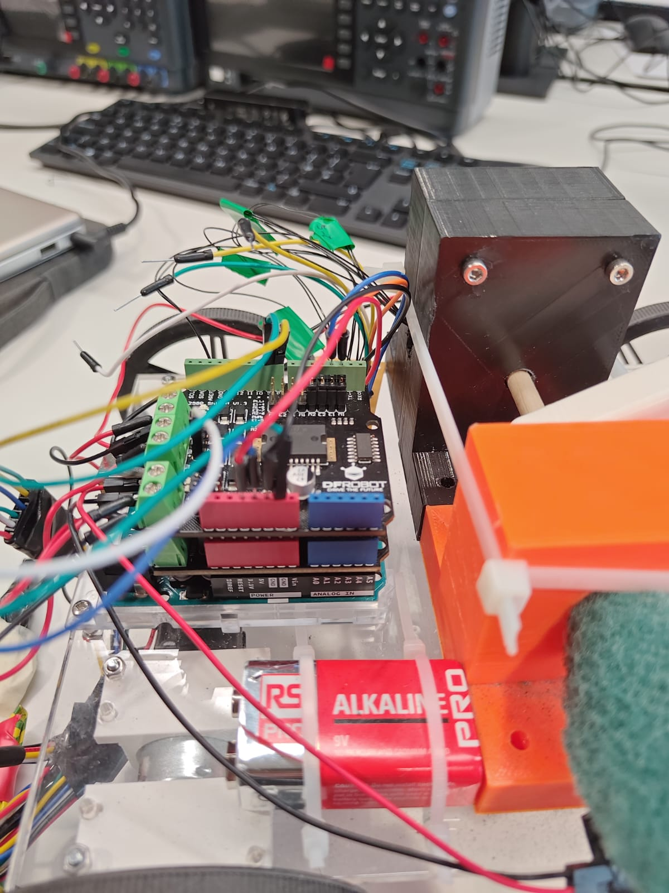
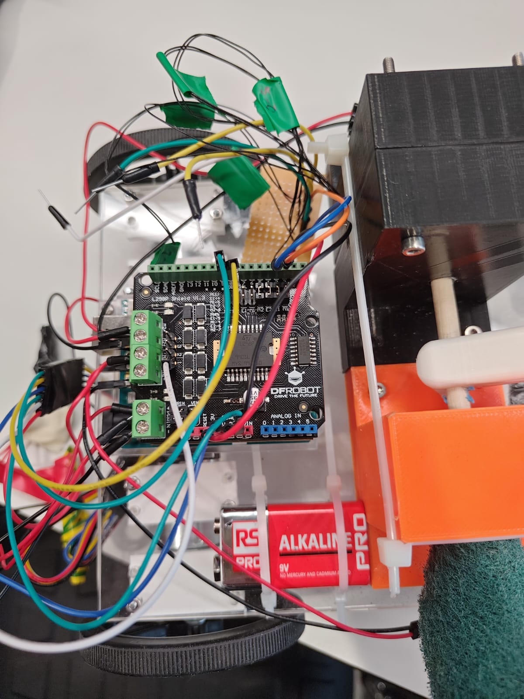

# Inverted Pendulum Arduino

This repository contains two Arduino-based control programs used in the inverted pendulum system for **COMP0216**. The project demonstrates **real-time control** of a cart-pendulum system using multiple strategies.

## Overview

This system is split into two main folders:

1. **Stabilisation Code** – Balances the pendulum in place using PID, LQR, or Pole Placement.
2. **Travel Code** – Drives the cart forward a fixed distance while maintaining balance.

The setup uses a rotary encoder from one of the motors and optical encoder for sensor feedback, and is powered via an Arduino Uno R3 and dual L298P motor shields.

---

##  Repository Structure
```
├── Stabilisation_Code/   
| ├── stabilising_code.ino 
│ └── controller.ino 
├── Travel_Code/ 
│ └── travel.ino 
├── RotaryEncoder.zip/ 
└── Images/
  ├── stack_systems.jpg 
  └── pins_systems.jpg
```
---

##  Features

-  **Real-time Inverted Pendulum Balancing**
-  **Multiple Control Strategies**:
  - PID Control
  - Pole Placement
  - LQR (Linear Quadratic Regulator)
-  **Forward Travel Support** with target distance control
-  **Sensor Integration** via motor encoder and optical encoder
-  **Tunable Parameters** in controller files

---

##  Installation & Setup

### Prerequisites

Install the following Arduino libraries:

-  **RotaryEncoder** (Modified) – included in this repository  
-> Unzip the contents of `RotaryEncoder.zip/` into your local Arduino `libraries/` folder.

-  **PinChangeInterrupt** – install via the Arduino Library Manager  
   -> Go to **Sketch > Include Library > Manage Libraries**, search for `"PinChangeInterrupt"`, and install it.

---

## 1. Stabilisation Code

Located in the `Stabilising_Code/` folder.

- `Stabilising_Code.ino` – Main loop, handles real-time control and sensor reading.
- `controller.ino` – Defines controller logic for:
  - PID (PD)
  - Pole Placement
  - LQR

The pendulum starts in the upright position and stabilized using the selected control method after a small disturbance is applied. 

### How to Run
1. Open `stabilising_code.ino` in Arduino IDE.
2. Choose the controller in `controller.ino` by toggling the variables at the top.
3. Upload the code to the Arduino Uno.

---

##  2. Travel Code

Located in the `Travel_code/` folder.

- `Travel_code.ino` is designed for **forward motion** while keeping the pendulum balanced.

Main features:
- Builds on the stabilisation system.
- Adds control over **target cart distance** using an additional PID loop.
- Ideal for measuring system behaviour during extended translation.

---

##  Hardware Configuration

This code is intended for use with:

-  **4-wheeled cart**
-  **Arduino Uno R3**
-  **2x DFRobot L298P Motor Shields**
-  **Motor encoder + optical encoder**

###  System Images

<div align="center">
  
  
</div>

###  Pin Connections

| Component             | Arduino Pins      |
| --------------------- | ----------------- |
| Motor encoder (1x)    | 8, 9              |
| Motor encoder power   | 5V and GND        |
| Optical encoder       | 2, 3 (Interrupts) |
| Optical encoder power | 3.3V and GND      |

- Only **one motor encoder** is required.
  - Multiple can be used but is redundant
- The **optical encoder** attached to the pivot of the pendulum to get the best readings. 
- Make sure to connect encoders correctly using 5V (motor encoder) and 3.3V (optical encoder).

---

##  Notes

- Ensure your hardware setup matches the wiring and pin diagrams shown above.
- The controller selection logic is modular and easily switchable in `controller.ino`.
- You can tune gains and modify the control strategy depending on your evaluation phase.

